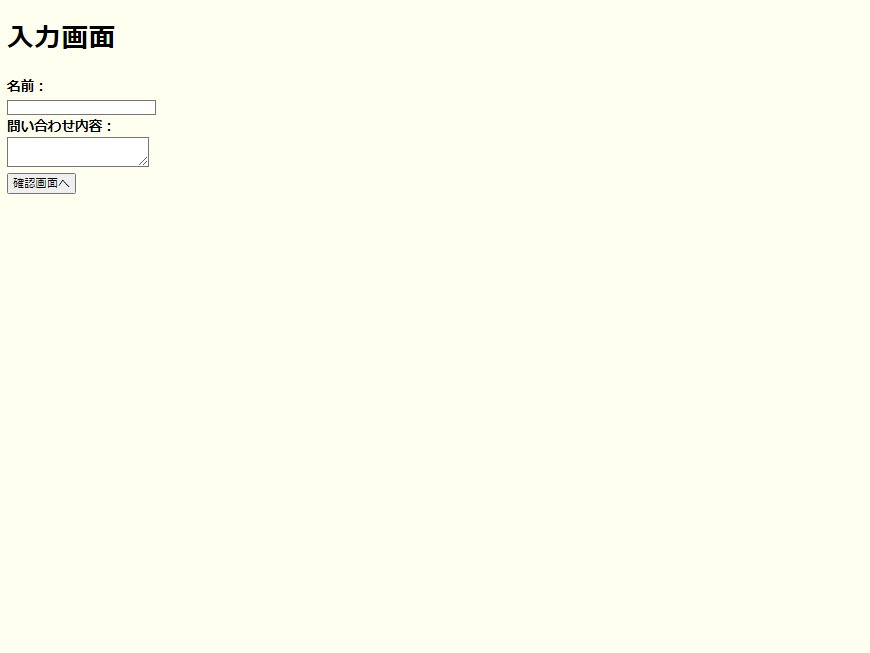
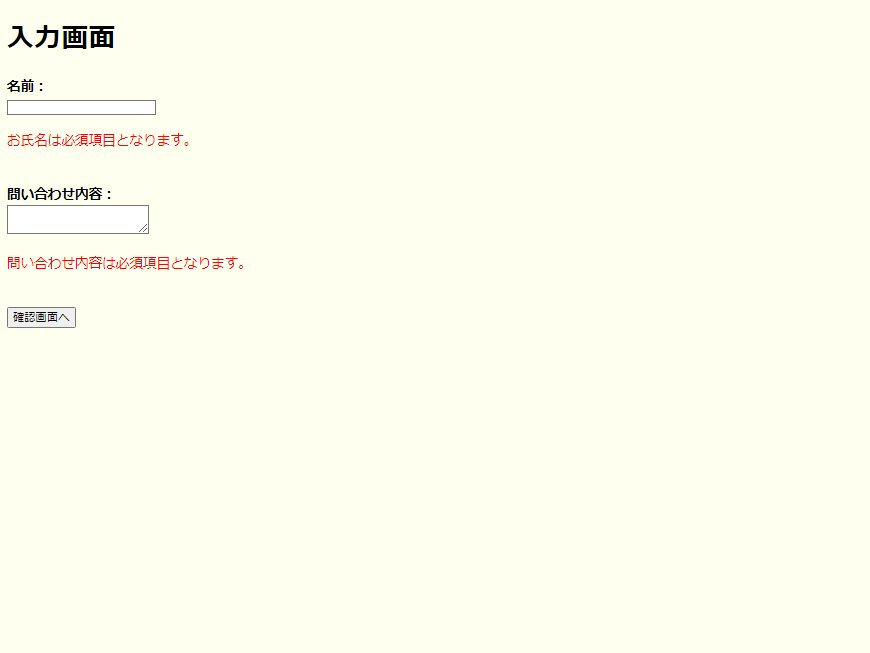
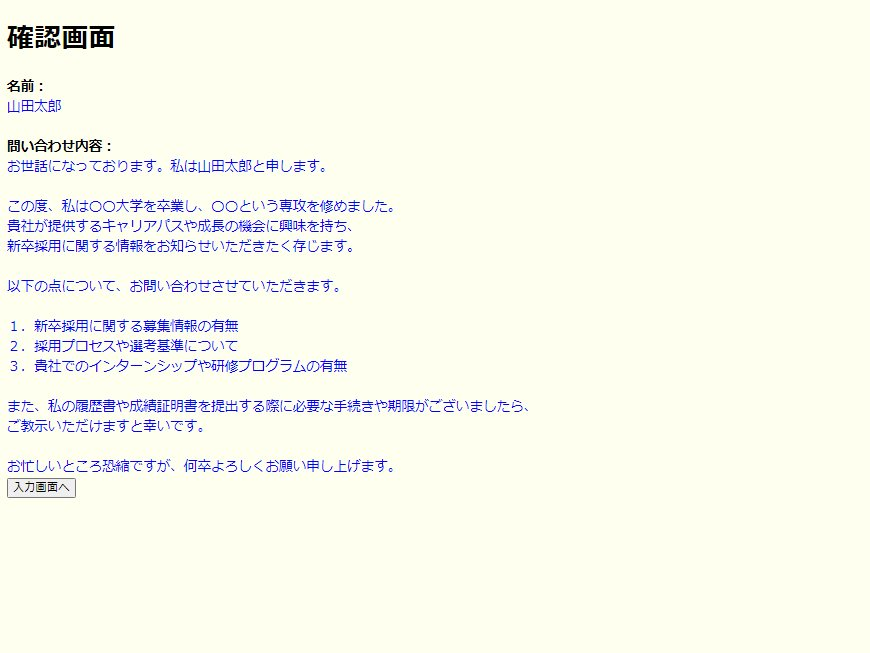

# JSP/Servlet 入力フォームのサンプル実装。

「入力画面」「確認画面」のサンプル実装です。

## 画面説明

サーバが起動したら下記URLでアプリケーションを表示します。 
[http://localhost:8080/engineers_gate_original_lesson_05_01_sample_01/input](http://localhost:8080/engineers_gate_original_lesson_05_01_sample_01/input)

### 入力画面

### 確認画面

